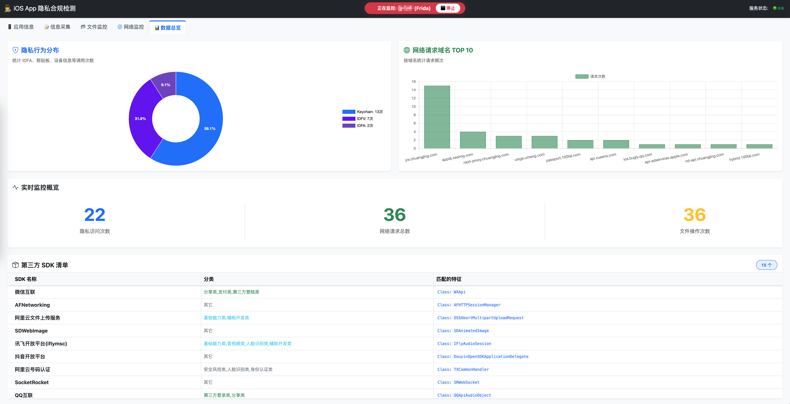

# 🕵️ iOS App 隐私合规检测系统
[](https://www.python.org/)
[](https://flask.palletsprojects.com/)
[](https://frida.re/)
[](LICENSE)

一个基于 **Python Flask** + **Frida** / **Theos Tweak** 的 iOS 应用隐私合规审计系统。
通过 Web 可视化界面，实时监控目标 App 的**网络请求**、**文件操作**及**敏感隐私信息获取**行为，辅助开发者和安全审计人员快速发现合规风险。

---

## 📖 项目背景

随着《个人信息保护法》及苹果 ATT (App Tracking Transparency) 政策的推行，App 的隐私合规变得至关重要。
传统的抓包工具或日志分析往往难以定位 App **在何时、何地、通过何种方式**获取了用户隐私（如 IDFA、剪贴板、设备指纹等）。

本项目旨在提供一个**开箱即用**的动态分析平台：
1.  **可视化**：无需看枯燥的命令行日志，Web 界面实时展示。
2.  **低门槛**：一键开启监控，自动注入 Hook 脚本。
3.  **双模式**：支持 **Frida (USB)** 快速调试和 **Tweak (越狱插件)** 持久化监控，适应不同场景。

---

## ✨ 核心功能

### 1. 📊 数据总览 (Dashboard)
-   **隐私行为分布**：通过环形图展示 IDFA、剪贴板、设备信息等敏感行为的占比。
-   **网络请求统计**：自动统计请求频次最高的 Top 10 域名。
-   **实时计数**：动态更新各类监控事件的总量。
 


### 2. 📱 应用管理
-   自动列出设备上已安装的用户应用（User Apps）。
-   提取并显示应用图标、Bundle ID 和版本号。
-   提供一键开启/停止监控入口。
 

### 3. 📝 信息采集 (Privacy Monitor)
重点监控 App 的敏感 API 调用，识别设备指纹收集行为：
-   **IDFA / IDFV** (广告标识符/供应商标识符)
-   **Clipboard** (剪贴板读取内容检测)
-   **Keychain** (读取、修改Keychain数据等)
-   **Location** (地理位置获取检测)
-   **PhotoLibrary** (获取相册信息)
-   **Contacts** (读取通讯录数据等)
-   *支持查看详细的调用堆栈，快速定位业务代码位置。*


### 4. 📂 文件监控 (File Monitor)
监控 App 对文件系统的操作：
-   **创建** (`createFileAtPath`, `open` with `O_CREAT`)
-   **删除** (`removeItemAtPath`, `unlink`)
-   **读取** (`fileHandleForReadingAtPath`)
-   **复制** (`copyItemAtPath`)
-   *支持行内展开查看详细的调用堆栈。*


### 5. 🌐 网络监控 (Network Monitor)
-   全面 Hook `NSURLSession` 等底层 API。
-   支持 **GET** 、 **POST** 和 **HEAD** 等请求捕获。
-   **Raw Request 查看**：支持查看完整的 HTTP Headers 和 Body 数据（自动格式化 JSON）。


### 6. 🛡️ 高级特性
-   **双模式支持**：
    -   **Frida 模式**：依赖 USB 连接，脚本实时注入，适合临时调试。
    -   **Tweak 模式**：通过 SSH 部署动态库，App 重启后生效，支持断开 USB 后的持久化监控，**自带反反调试能力**。
-   **防锁屏**：监控开启后自动禁止屏幕休眠（Frida 模式）。
-   **断线重连**：前端 UI 具备完善的状态管理和错误恢复机制。

---

## 💻 环境要求

### 硬件环境
-   **PC**: macOS (推荐) / Windows / Linux
-   **手机**: 已越狱的 iPhone (iOS 12.0 - 16.x)

### 软件依赖
-   **Python**: 3.9 及以上
-   **iOS 端**:
    -   已安装 `Frida` (源: `build.frida.re`)
    -   已安装 `OpenSSH` (默认密码 `alpine`)
    -   (可选) 越狱插件防反调试工具

---

## 🚀 快速开始 (Frida 模式)

### 1. 安装依赖
在项目根目录下运行：
```bash
pip install -r requirements.txt
```
(注：项目锁定 Frida 版本为 16.2.1 以保证稳定性)
### 2. 启动服务
确保手机通过 USB 连接电脑，并已信任电脑。
```bash
python run.py
```
### 3. 访问 Web 界面
打开浏览器访问：http://127.0.0.1:8080

### 4. 开始监控
在“应用信息”页面点击 🔄 刷新列表。
找到目标 App，点击 📡 开启监控。
保持默认 Frida (USB) 模式，点击确认。
手机上的 App 将自动启动，Web 端将自动跳转至数据展示页。

## 🛠️ 进阶使用 (Tweak 模式)

Tweak 模式需要编译 Objective-C 动态库，适合对抗反调试更强的 App。

### 1. 编译环境准备
你需要安装 **Theos** 编译环境（通常需要 macOS 或 Linux）。
- [Theos 安装指南](https://github.com/theos/theos/wiki/Installation)
- 确保已安装 `ldid` 用于签名。

### 2. 编译插件
进入 `tweak_monitor` 目录：
```bash
# 清理缓存
make clean
# 编译
make package
```
编译成功后，在 .theos/obj/debug/ 目录下会生成 MonitorTweak.dylib。
### 3. 部署插件文件
将生成的 MonitorTweak.dylib 复制到 Python 项目的 app/tweak_libs/ 目录下。
```bash
# 示例命令
mkdir -p app/tweak_libs
cp path/to/MonitorTweak.dylib app_monitor/app/tweak_libs/MonitorTweak.dylib
```
### 4. 使用 Tweak 模式启动
1. 在 Web 界面点击 📡 开启监控。
2. 选择 Tweak (越狱插件) 模式。
3. 输入 手机 IP (如 192.168.1.101) 和 电脑 IP (如 192.168.1.100)。
4. 点击确认。系统会自动通过 SSH 上传插件并重启 App。
"""
## 📂 项目结构
```

app-monitor/
├── run.py                  # 项目启动入口
├── config.py               # 配置文件 (SSH 账号等)
├── requirements.txt        # Python 依赖
├── app/
│   ├── __init__.py         # Flask App 初始化
│   ├── api/                # 后端 API 路由
│   ├── services/           # 核心服务 (Frida管理, Tweak部署)
│   ├── frida_scripts/      # Frida JS 注入脚本 (network, file, privacy...)
│   ├── tweak_libs/         # 存放编译好的 MonitorTweak.dylib
│   ├── utils/              # 将App图标转为在可在Web页面中显示的Base64格式
│   ├── web/                # Web页面入口点
│   ├── static/             # 前端静态资源 (CSS, JS Modules)
│   └── templates/          # HTML 模板
tweak_monitor/              
├── module/
│   └── Symbol/             # 用于获取函数调用堆栈
├── Tweak.x                 # 主Tweak文件
├── MonitorFiles.x          # 文件监控模块
├── MonitorHooks.x          # 隐私监控模块
├── MonitorUtils.h          # 监控工具头文件
├── MonitorUtils.m          # 监控工具实现文件
├── MonitorTweak.plist      # Tweak的配置文件
└── Makefile                # 编译配置文件

```

## ⚠️ 免责声明
本工具仅用于安全研究、应用审计及合规检测目的。
请勿使用本工具对未经授权的应用程序进行分析或攻击。使用者需遵守当地法律法规，开发者对使用本工具造成的任何后果概不负责。

## 🤝 贡献与反馈
欢迎提交 Issue 或 Pull Request 来完善此工具！
如果觉得好用，请给项目点个 ⭐ Star 支持一下！
